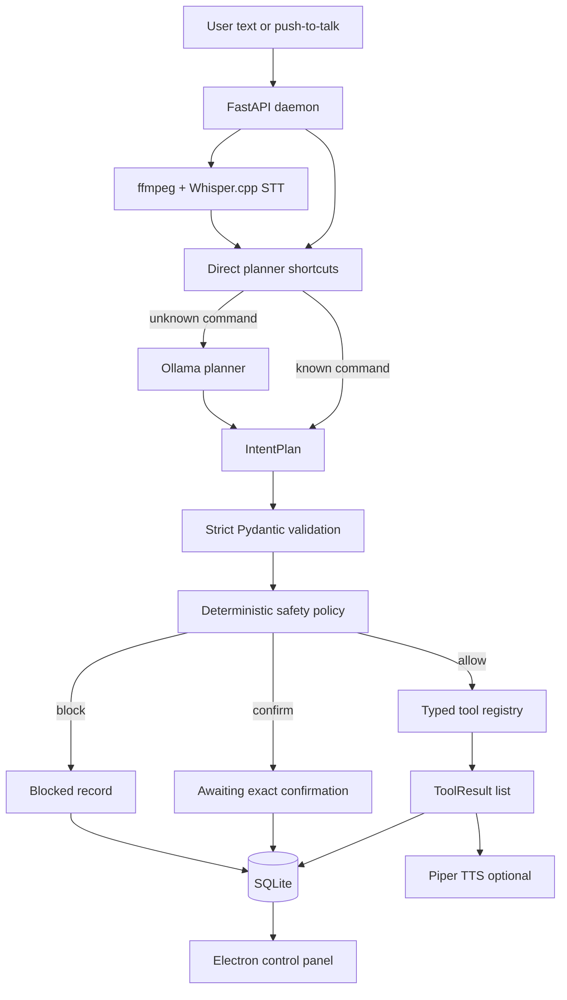

# SAGE

System Assistant for General Execution.

SAGE is a local-first command layer for developer laptops. It accepts text or
push-to-talk voice commands, plans the user's intent with deterministic shortcuts
or a local Ollama model, validates the plan through strict typed contracts,
executes only registered tools, stores an auditable command record in SQLite,
and can speak a concise response with Piper.

The portfolio goal is not to build an unrestricted desktop agent. SAGE is meant
to show a safer architecture for local AI automation: model output is treated as
an untrusted proposal, every executable action must match a typed tool schema,
and risky work must pass deterministic safety checks before it can run.

## Current Capabilities

- Local FastAPI daemon on `127.0.0.1:8765`
- CLI for text commands, voice commands, history, tools, diagnostics, workflows,
  settings, and profile management
- Push-to-talk `listen-once` flow through ffmpeg and Whisper.cpp
- Local Ollama planner with deterministic direct-planner shortcuts
- Typed tool registry for project inspection, project text search, processes,
  ports, system info, memory info, assistant profile, and constrained test runs
- Safety policy for allow, confirm, and block decisions
- SQLite storage for commands, settings, assistant profile, and workflows
- Optional Piper text-to-speech responses
- Electron/Vite control panel for health, diagnostics, commands, tools,
  workflows, and storage stats

## Architecture



The daemon is the source of truth. The Electron app reads from the daemon API
and does not execute system commands directly.

## Safety Model

SAGE does not execute arbitrary model-generated shell commands. The local model
can only propose an `IntentPlan`. The daemon then:

1. validates the plan against strict Pydantic contracts,
2. rejects unknown tools,
3. validates every tool argument against that tool's schema,
4. applies deterministic risk rules,
5. constrains tool paths to the command workspace,
6. persists the full command record for inspection.

Read-only and safe-execution tools can run without confirmation. State-changing
work requires an exact phrase such as `confirm start`. Destructive, privileged,
credential-related, and explicitly blocked patterns are blocked.

## Local Setup

SAGE is Linux-first and designed to run without paid APIs. See
[docs/local-setup.md](docs/local-setup.md) for the full zero-to-demo path.

Quick backend setup:

```bash
./scripts/setup-local.sh
```

Manual dependencies still need to be installed on the laptop:

- `ffmpeg`
- `rg`
- Ollama with the configured model pulled
- Whisper.cpp server or CLI plus a local Whisper model
- Piper plus a local voice model, unless TTS is disabled
- Node/npm for the control panel

Run checks:

```bash
.venv/bin/pytest
.venv/bin/ruff check .
cd apps/electron-control-panel && npm run build
```

Run the local stack:

```bash
systemctl start ollama
.venv/bin/sage start --with-ui
```

Open the control panel:

```text
http://127.0.0.1:5174
```

## Demo Script

After the daemon is running, use these reliable commands first:

```bash
.venv/bin/sage daemon health
.venv/bin/sage text "who are you"
.venv/bin/sage text "what project is this"
.venv/bin/sage text "summarize this project"
.venv/bin/sage text "what is running on port 3000"
.venv/bin/sage text "run tests"
.venv/bin/sage commands recent
```

For voice:

```bash
.venv/bin/sage listen-once
```

## Manual Configuration

Machine-specific paths and local service state are intentionally not committed.
Use `.env.example`, `apps/electron-control-panel/.env.example`, and
[docs/local-setup.md](docs/local-setup.md) as references.

Current runtime settings are stored in SQLite through the daemon settings API.
The Phase 1 examples document the values that need to be wired manually; later
phases will make the settings UI and doctor output more guided.

## Development

```bash
python3 -m venv .venv
.venv/bin/python -m pip install --upgrade pip setuptools wheel
.venv/bin/python -m pip install -e ".[dev]"
```

The Electron control panel keeps Node dependencies inside
`apps/electron-control-panel/node_modules`:

```bash
cd apps/electron-control-panel
npm install
```

## Known Limitations

- Linux-first, currently tuned for Fedora/KDE/PipeWire-style local setups.
- Whisper.cpp, Ollama, and Piper require local models that are not committed.
- The control panel is still a dashboard scaffold, not a full command console.
- Workflows can be stored, listed, and deleted, but first-class workflow
  execution is planned for a later phase.
- Wake word, always-on mode, custom remote providers, hybrid routing, plugins,
  and production installers are intentionally deferred.
