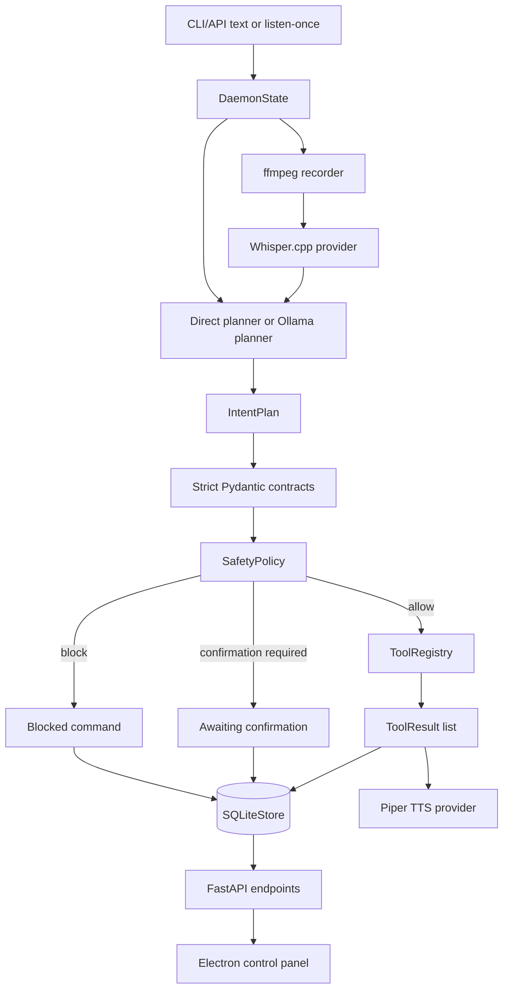

# Architecture

SAGE is split into a local Python daemon and an Electron control panel. The
daemon is the source of truth. It owns speech input, transcription, planning,
safety validation, typed tool execution, speech output, persistence, and
diagnostics.

The Electron app connects to the daemon over the local API. It does not execute
system commands directly.

## Runtime Flow

```text
text command or push-to-talk
  -> FastAPI daemon
  -> optional audio capture with ffmpeg
  -> optional Whisper.cpp transcription
  -> direct planner for obvious commands
  -> Ollama planner for other commands
  -> strict IntentPlan validation
  -> deterministic safety policy
  -> typed tool execution
  -> SQLite command record
  -> optional Piper spoken response
  -> Electron control panel display
```



## Shared Contracts

The command pipeline shares a single contract layer in `sage.contracts`.

Core contracts include:

- `ToolCall`
- `IntentPlan`
- `ToolResult`
- `ExecutionResult`
- `SpeechResult`
- `CommandRecord`
- `RuntimeSettings`
- `AssistantProfile`
- `Workflow`
- `ToolSchema`
- `DiagnosticStatus`

All SAGE contract models reject unknown fields by default. That keeps model
output, API payloads, tool input, and logs aligned around explicit schemas.

## Local API

The daemon exposes a FastAPI app on `127.0.0.1:8765` by default.

Current endpoints:

- `GET /health`
- `POST /commands/text`
- `POST /commands/listen-once`
- `GET /commands/recent`
- `POST /commands/{command_id}/confirm`
- `POST /commands/{command_id}/cancel`
- `GET /tools`
- `GET /workflows`
- `POST /workflows`
- `DELETE /workflows/{workflow_id}`
- `GET /diagnostics`
- `GET /storage`
- `GET /settings`
- `PUT /settings`
- `GET /profile`
- `PUT /profile`

Command detail and workflow execution endpoints are planned next.

## Planning

SAGE has two planning paths.

The direct planner handles reliable local commands without calling the LLM, such
as:

- assistant identity and capabilities
- system info
- memory info
- project detection
- project summary
- process listing
- port lookup
- running the constrained test command

Other commands go to the Ollama planner. The planner asks Ollama for one JSON
object matching the `IntentPlan` schema. The result is parsed and validated with
Pydantic. If validation fails, SAGE retries once with a repair prompt by default.

## Safety And Execution

SAGE does not run arbitrary model-generated shell commands.

Execution rules:

- every executable action must be a registered typed tool,
- unknown tools are blocked,
- tool arguments must validate against the tool's Pydantic args model,
- tool paths are constrained to the command workspace,
- read-only and safe-execution tools can execute immediately,
- state-changing plans require exact confirmation,
- destructive, privileged, credential-related, and explicitly blocked patterns
  are blocked.

Allowed plans with actions execute through `ToolRegistry`. Results are stored in
the command record. Plans with no executable actions fail with a clear error
instead of remaining indefinitely planned.

## Persistence

SQLite stores:

- command records,
- runtime settings,
- assistant profile,
- workflows.

The daemon loads recent command history from SQLite on startup and also keeps a
bounded in-memory recent-command deque for fast access.

## Voice

Voice input:

```text
record WAV with ffmpeg
  -> transcribe with Whisper.cpp HTTP or CLI provider
  -> process the transcript like a text command
```

Raw audio is deleted by default. Set `keep_raw_audio` to `true` only for
debugging.

Voice output:

```text
command record
  -> spoken summary
  -> Piper synthesis
  -> audio playback
```

Missing Piper configuration is recorded as a speech failure without failing the
command itself.

## Control Panel

The Electron control panel under `apps/electron-control-panel` reads from the
daemon API and shows:

- health,
- diagnostics,
- recent commands,
- registered tools,
- workflows,
- storage stats.

The daemon enables CORS only for local control-panel development origins. The
Electron main process uses context isolation, sandboxing, disabled Node
integration, and blocks arbitrary navigation/window creation.

## Deferred Architecture

These are intentionally out of the portfolio-ready critical path:

- wake word,
- always-on assistant mode,
- custom remote API providers,
- hybrid LLM routing,
- plugin system,
- production installers,
- cross-platform support.
